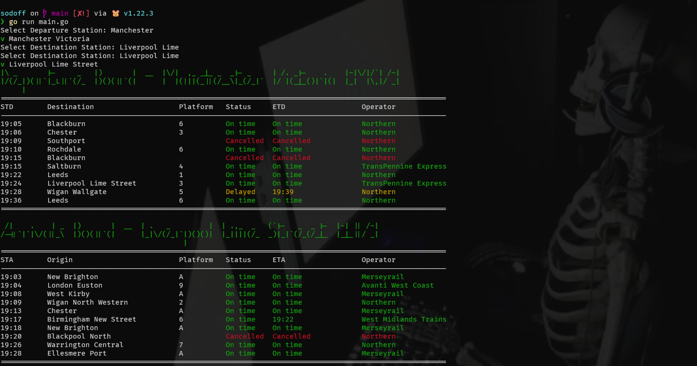

# sodoff

Dead simple CLI tool to tell you which bloody trains are delayed/cancelled, innit?



## CLI Usage

A token for the use of the National Rail SOAP API is required. You can get one [here.](https://realtime.nationalrail.co.uk/OpenLDBWSRegistration/).

```sh
# Check once
sodoff --to MCO --from LIV

# Continuously check every 2 seconds
sodoff --to MCO --from LIV" --continuous
```

> **Note**: The `--from` and `--to` flags are __NOT__ required. Recommended to use the in-built input search.
