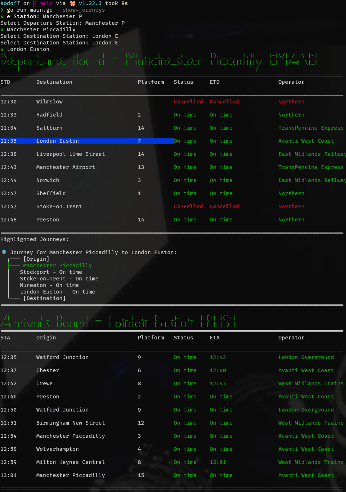

# sodoff

Dead simple CLI tool to tell you which bloody trains are delayed/cancelled, innit?



## CLI Usage

```sh
# Check onced
train-cli check --from "StationA" --to "StationB"

# Continuously check every 2 seconds
train-cli check --from "StationA" --to "StationB" --continuous
```

> **Note**: The `--from` and `--to` flags are __NOT__ required. Recommended to use the input search.
